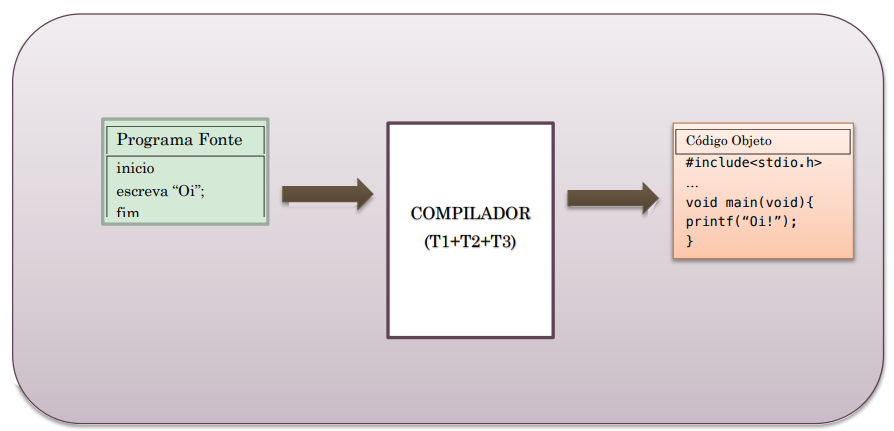
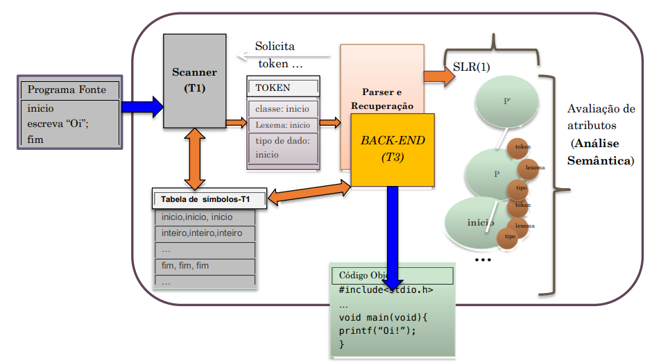
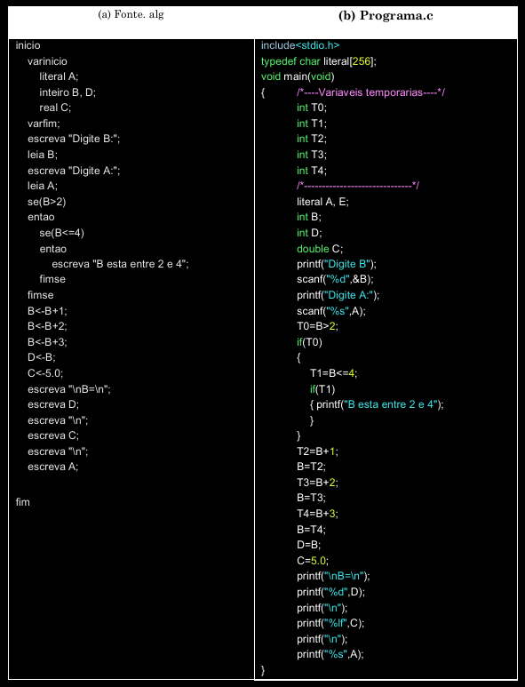

# PROJETO: Desenvolvimento de um compilador
Este repositório objetiva o desenvolvimento de um **compilador** que recebe como entrada um arquivo fonte na linguagem **Mgol**, realiza as fases de análise, síntese e semântica e, por fim, gera um arquivo objeto na linguagem **C**. O arquivo final deve ser compatível com um compilador de C (eg. GCC).

Os módulos a serem implementados contemplam

# Etapa 1: Analisador Léxico
Adicionar descrição
# Etapa 2: Analisador Sintático
~Socorro Deus~
# Etapa 3: Analisador Semântico
~Temo pela minha vida~

# Arquitetura Geral

Ao final, teremos como sistema e resultado do estudo de caso, um pequeno compilador que compilará o programa fonte (linguagem Mgol), Fonte.ALG (a) em PROGRAMA.C (b).

---

# Tabelas Auxiliares

## TABELA 1 - Alfabeto

|Definições | Significado |
|-----------|-------------|
| Dígitos   | 0, 1, 2, 3, 4, 5, 6, 7, 8, 9 |
| Letras    | A, B, C..., Z, a, b, c..., z |
| Demais caracteres | ,(vírgula), ;(ponto e vírgula), :(dois pontos), .(ponto), !, ?, , * ,+ ,- , / , (, ), {, }, [,], <, >, =‘(aspas simples), “ (aspas duplas), _(underline) |

## TABELA 2 - Palavras Reservadas
## TABELA 3 - Tabela de Tokens

